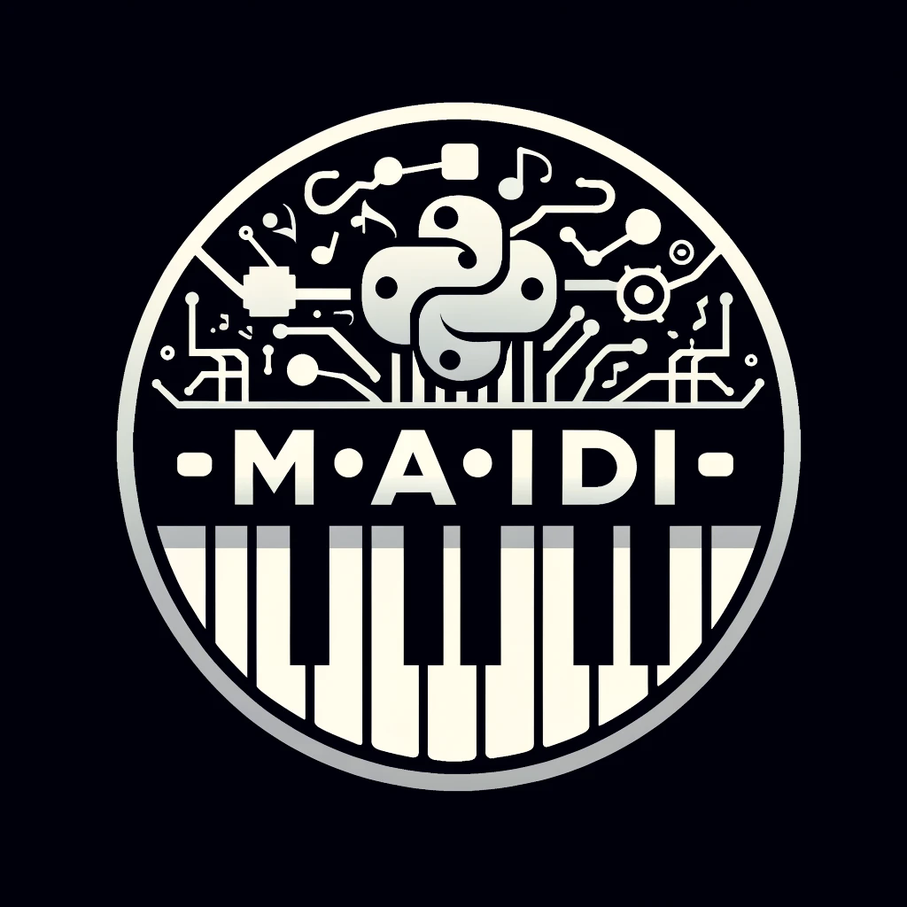

M(AI)DI
=======

**/!\ : Still work in progress, will be officially released around 2024/06/15** 

M(ai)di is an open source python library that aims to highlight the capabilities and usefulness of the **Symbolic Music GenAI**. 
It interfaces with the best symbolic music AI models and APIs to **accelerate AI integration in music tech products**.
It came from the realization that artists need to manipulate MIDI and not only audio in their composition workflow but tools are lacking in this area.

So here we are, providing a simple and efficient way to manipulate midi files and integrate with music AI models.
In a few lines of code you will be able to parse, analyze and generate midi files with the best music AI models available.

**Here is where M(ai)di shines:**

- **Midi Files Manipulation**: Load, save, edit, merge and analyze midi files with ease.
- **Music AI Models Integration**: Integrate with the best music AI models and APIs to generate music.
- **Automatic MIDI tagging**: Get the chords, tempo, time signature, and many other musical features for each bar/instrument of the midi file.

*Disclaimer : We really focus on processing midi files and model inference calls. We don't implement audio features, neither model training, neither tokenization.*

[Read the official documentation](https://maidi.readthedocs.io/en/latest/)

Getting Started
===============

Installation
------------
To install the package, you can use pip:

```bash
pip install maidi
```

Or to get the latest version from the repository, you can use:

```bash
pip install git+github.com/MusicLang/maidi.git

```

Usage
-----

A simple code snippet to load and analyze a midi file : 

```python
from maidi import MidiScore, ScoreTagger, midi_library
from maidi.analysis import tags_providers

score = MidiScore.from_midi(midi_library.get_midi_file('drum_and_bass'))

tagger = ScoreTagger(
    [
        tags_providers.DensityTagsProvider(),
        tags_providers.MinMaxPolyphonyTagsProvider(),
        tags_providers.MinMaxRegisterTagsProvider(),
        tags_providers.SpecialNotesTagsProvider(),
    ]
)

tags = tagger.tag_score(score)
chords = score.get_chords_prompt()
print(tags)
print(chords)
```


Integrations
============

With MusicLang API
------------------

MusicLang is a co-pilot for music composition. It is a music AI model that can modify a midi score based on a prompt.
The API is integrated into M(AI)DI to provide a seamless experience for the user.


**A simple example: Generate a 4 bar score** with the musiclang masking model API.
Just set your API_KEY in the environment (or get one [here](www.musiclang.io)) and run the following code :

```python
from maidi import MidiScore
from maidi import instrument
import os
from maidi.integrations.api import MusicLangAPI

# Assuming API_KEY is set in the environment
API_KEY = os.getenv("API_KEY")

# Your choice of params for generation here
instruments = [
    instrument.DRUMS,
    instrument.ELECTRIC_BASS_FINGER,
]

# Create a 4 bar template with the given instruments
score = MidiScore.from_empty(
    instruments=instruments, nb_bars=4, ts=(4, 4), tempo=120
)
# Get the controls (the prompt) for this score
mask, tags, chords = score.get_empty_controls(prevent_silence=True)
mask[:, :] = 1  # Regenerate everything in the score

# Call the musiclang API to predict the score
api = MusicLangAPI(api_key=API_KEY, verbose=True)
predicted_score = api.predict(score,
    mask, tags=tags, chords=chords, async_mode=False, polling_interval=5
)
predicted_score.write("predicted_score.mid")
```

**Generate a new track in a score** : Start from a midi file and add a track.

```python
import os
from maidi import MidiScore, instrument, midi_library
from maidi.integrations.api import MusicLangAPI

# Assuming API_KEY is set in the environment
API_KEY = os.getenv("API_KEY")

# Create a 4 bar template with the given instruments
score = MidiScore.from_midi(midi_library.get_midi_file('drum_and_bass'))
# Add a clean guitar track and set the mask
score = score.add_instrument(instrument.CLEAN_GUITAR)
mask, _, _ = score.get_empty_controls(prevent_silence=True)
mask[-1, :] = 1  # Generate the last track

# Call the musiclang API to predict the score
api = MusicLangAPI(api_key=API_KEY, verbose=True)
predicted_score = api.predict(score,
    mask, async_mode=False, polling_interval=3
)
predicted_score.write("predicted_score.mid")
```

**Generate a track that has the same characteristics as an existing midi files** : Start from a midi file and generate a new track with the same characteristics.

```python
import os
from maidi import MidiScore, ScoreTagger, midi_library
from maidi.analysis import tags_providers
from maidi.integrations.api import MusicLangAPI

# Assuming API_KEY are set in the environment
API_KEY = os.getenv("API_KEY")
# Load a midi file
score = MidiScore.from_midi(midi_library.get_midi_file('example1'))

# Get a score with the first track and the first 4 bars of the midi file
score = score[0, :4]

tagger = ScoreTagger(
    [
        tags_providers.DensityTagsProvider(),
        tags_providers.MinMaxPolyphonyTagsProvider(),
        tags_providers.MinMaxRegisterTagsProvider(),
        tags_providers.SpecialNotesTagsProvider(),
    ]
)
tags = tagger.tag_score(score)
chords = score.get_chords_prompt()
mask = score.get_mask()
mask[:, :] = 1  # Regenerate everything in the score

api = MusicLangAPI(api_key=API_KEY, verbose=True)
predicted_score = api.predict(score,
    mask, async_mode=False, polling_interval=3
)
predicted_score.write("predicted_score.mid")
```

For more details on the API, please refer to the [MusicLang API documentation](https://api.musiclang.io/documentation).


With other tools and APIs
-------------------------

See [CONTRIBUTING.md](CONTRIBUTING.md) for more details.

Contributing
============

We welcome contributions to the project as long as it fits its main philosophy :

- Manipulate midi files in some ways
- Integrate with music AI models (inference & symbolic only)

Please read [CONTRIBUTING.md](CONTRIBUTING.md) for more details.


Next steps
==========

- Add musiclang_predict song extension open source model
- Improve documentation and examples
- Add more integrations with other symbolic models
- Better handling of the chord progression and tags

License
=======

This project is licensed under the Apache License 2.0 - see the [LICENSE](LICENSE.md) file for details.
