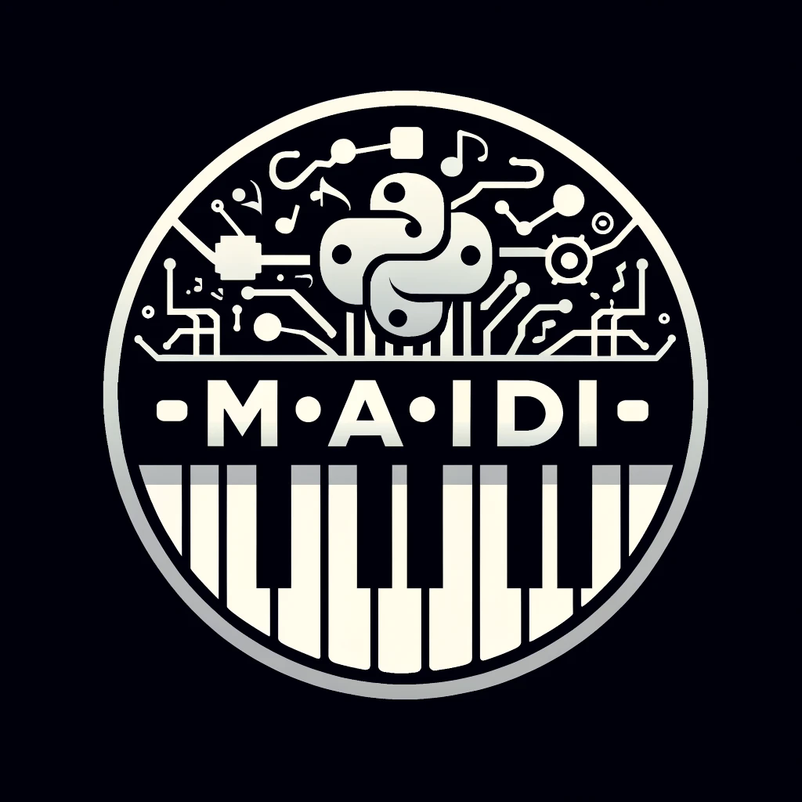

Below an image : 



M(AI)DI
=======

M(AI)DI is the MIDI file processor designed to integrate with symbolic music generative AI models.

It is designed to prepare your midi files for inference and post-process the generated midi files.
We don't focus on model training or tokenization, but we provide a simple and efficient way to integrate your models with M(AI)DI.


Getting Started
===============

Installation
------------
To install the package, you can use pip:

```bash
pip install maidi
```

Usage
-----

```python
from maidi import MidiScore

# Load a midi file
score = MidiScore('path/to/midi/file.mid')

# Get a score with the first track and the first 4 bars of the midi file
score = score[0, :4]

# Get the chord progression of the score
chords = score.get_chords_prompt()

# Save the score
score.write('path/to/save/midi/file.mid')
```


Integrations
============

With MusicLang API
------------------

MusicLang is a co-pilot for music composition. It is a music AI model that can modify a midi score based on a prompt.
The API is integrated into M(AI)DI to provide a seamless experience for the user.


**A simple example** : generate a 4 bar score with the musiclang masking model async API.
Just set your API_URL and API_KEY in the environment (or get one [here](www.musiclang.io)) and run the following code :

```python
from maidi import MidiScore
from maidi import instrument
import os
from maidi.integrations.api import MusicLangAPI

# Assuming API_URL and API_KEY are set in the environment
API_URL = os.getenv("API_URL")
API_KEY = os.getenv("API_KEY")

# Your choice of params for generation here
instruments = [
    instrument.DRUMS,
    instrument.ELECTRIC_BASS_FINGER,
]

# Create a 4 bar template with the given instruments
score = MidiScore.from_empty(
    instruments=instruments, nb_bars=4, ts=(4, 4), tempo=120
)
# Get the controls (the prompt) for this score
mask, tags, chords = score.get_empty_controls(prevent_silence=True)
mask[:, :] = 1  # Regenerate everything in the score

# Call the musiclang API to predict the score
api = MusicLangAPI(API_URL, API_KEY, verbose=True)
predicted_score = api.predict(score,
    mask, tags=tags, chords=chords, async_mode=False, polling_interval=5
)
predicted_score.write("predicted_score.mid")
```


**A more complex example** : generate a 4 bar score with the musiclang masking model async API.

```python
import os
from maidi import MidiScore, instrument, midi_library
from maidi.integrations.api import MusicLangAPI

# Assuming API_URL and API_KEY are set in the environment
API_URL = os.getenv("API_URL")
API_KEY = os.getenv("API_KEY")

# Create a 4 bar template with the given instruments
score = MidiScore.from_midi(midi_library.get_midi_file('drum_and_bass'))
# Add a clean guitar track and set the mask
score = score.add_instrument(instrument.CLEAN_GUITAR)
mask, _, _ = score.get_empty_controls(prevent_silence=True)
mask[-1, :] = 1  # Generate the last track

# Call the musiclang API to predict the score
api = MusicLangAPI(API_URL, API_KEY, verbose=True)
predicted_score = api.predict(score,
    mask, async_mode=False, polling_interval=3
)
predicted_score.write("predicted_score.mid")
```


Contributing
============

Please read [CONTRIBUTING.md](CONTRIBUTING.md) for details on our code of conduct, and the process for submitting pull requests to us.
