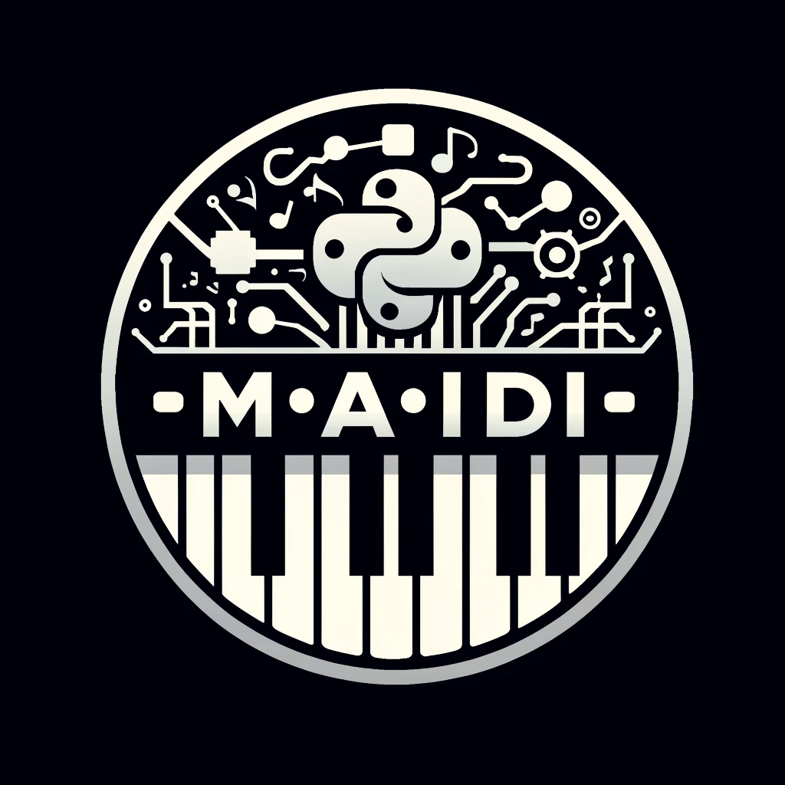

About M(AI)DI
===============

M(ai)di is an open-source Python library designed to showcase the capabilities and usefulness of **Symbolic Music GenAI**. 
It interfaces with top symbolic music AI models and APIs to **accelerate AI integration in music tech products**. 
The project originated from the realization that artists need to manipulate MIDI, not just audio, in their composition workflows, and that tools in this area are lacking.
Thus, we present a simple and efficient way to manipulate MIDI files and integrate with music AI models. With just a few lines of code, you can parse, analyze, and generate MIDI files using the best music AI models available.

**Here is where M(ai)di shines:**

- **MIDI Files Manipulation**: Load, save, edit, merge, and analyze MIDI files with ease.

- **Music AI Models Integration**: Integrate with the best music AI models and APIs to generate music.

- **Automatic MIDI Tagging**: Get the chords, tempo, time signature, and many other musical features for each bar/instrument of the MIDI file.

*Disclaimer: We focus on processing MIDI files and model inference calls. We do not implement audio features, model training, or tokenization.*

Getting Started
===============

Installation
------------
To install the package, you can use pip::

    pip install maidi

Or to get the latest version from the repository, you can use::

    pip install git+github.com/MusicLang/maidi.git

Hello World script
-------------------

A simple code snippet to load and analyze a midi file ::

    from maidi import MidiScore, ScoreTagger, midi_library
    from maidi.analysis import tags_providers

    score = MidiScore.from_midi(midi_library.get_midi_file('drum_and_bass'))

    tagger = ScoreTagger(
        [
            tags_providers.DensityTagsProvider(),
            tags_providers.MinMaxPolyphonyTagsProvider(),
            tags_providers.MinMaxRegisterTagsProvider(),
            tags_providers.SpecialNotesTagsProvider(),
        ]
    )

    tags = tagger.tag_score(score)
    chords = score.get_chords_prompt()
    print(tags)
    print(chords)

Integrations
============

The power of maidi comes from its ability to integrate with the best music AI models and APIs.

Please refer to the :ref:`integrations` section for more details on how to integrate with music AI models.

Contributing
============

We welcome contributions to the project as long as it fits its main philosophy :

- Manipulate midi files in some ways
- Integrate with music AI models (inference & symbolic only)

Please read :ref:`contributing` for details on our guidelines.

License
=========

This package is licensed under the Apache License 2.0
